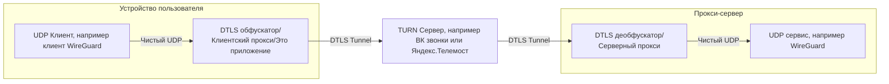

# TURN Proxy


[//]: # ""


## Отказ от ответственности (дисклеймер)

Данный проект является исследовательским, автор не несёт ответственности за использование его трудов для обхода
блокировок запрещённых сервисов. Также автор не ручается за нарушение пользовательского соглашения провайдеров сервисов,
предоставляющих услуги видеозвонков.
Поэтому советую вам использовать, пока что, [клиент от cacggghp](https://github.com/cacggghp/vk-turn-proxy)

## Что этот проект делает

Этот проект принимает и отсылает DTLS пакеты сквозь TURN сервера, используя их как прокси сервера меж условным клиентом и сервером, данный проект является именно первым.

Проще говоря, этот проект изучает как работают видеозвонки в компьютерной сети "Интернет", позволяя передавать через них
не только аудио и видео информацию, но вообще любую, при этом исключая MITM-атаку и анализ с помощью шифрования DTLS



## Развёртка

На данный момент доступны [`flake.nix`](./flake.nix) для пакетного менеджера Nix вместе с модулем для NixOS, а также
[`PKGBUILD`](./PKGBUILD) для Arch Linux. В Releases также доступны пакеты для Debian-based и RPM-based дистрибутивов. В скором времени может добавиться поддержка ОС Windows и Android.

<!--### Быстрая установка (Debian/Ubuntu/Fedora/и производные)
```bash
curl -sSL https://raw.githubusercontent.com/Urtyom-Alyanov/turn-proxy-client/master/install.sh | bash
```-->

#### Минимальные требования

- Ubuntu 21.10 (или 22.04 LTS)
- Debian 12 (Bookworm)
- Fedora 35
- RHEL / CentOS 9

Проще говоря, нужна минимальная версия glibc: `2.27`

README потом закончу
